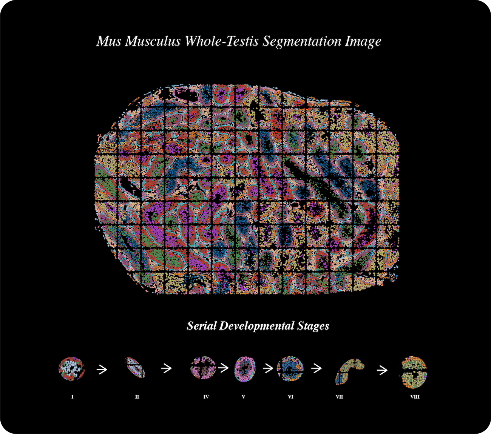
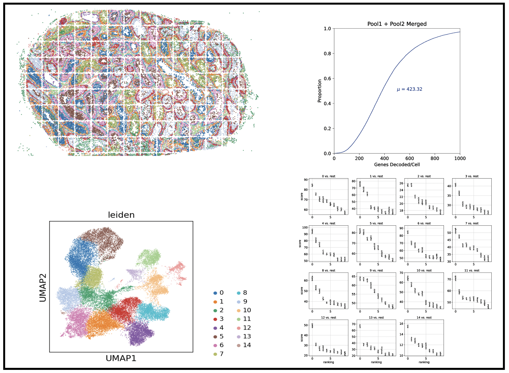
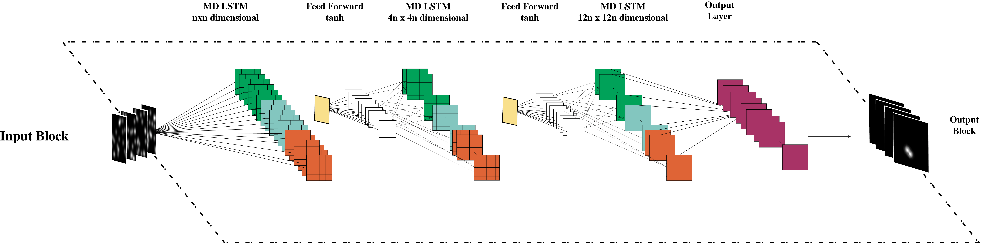
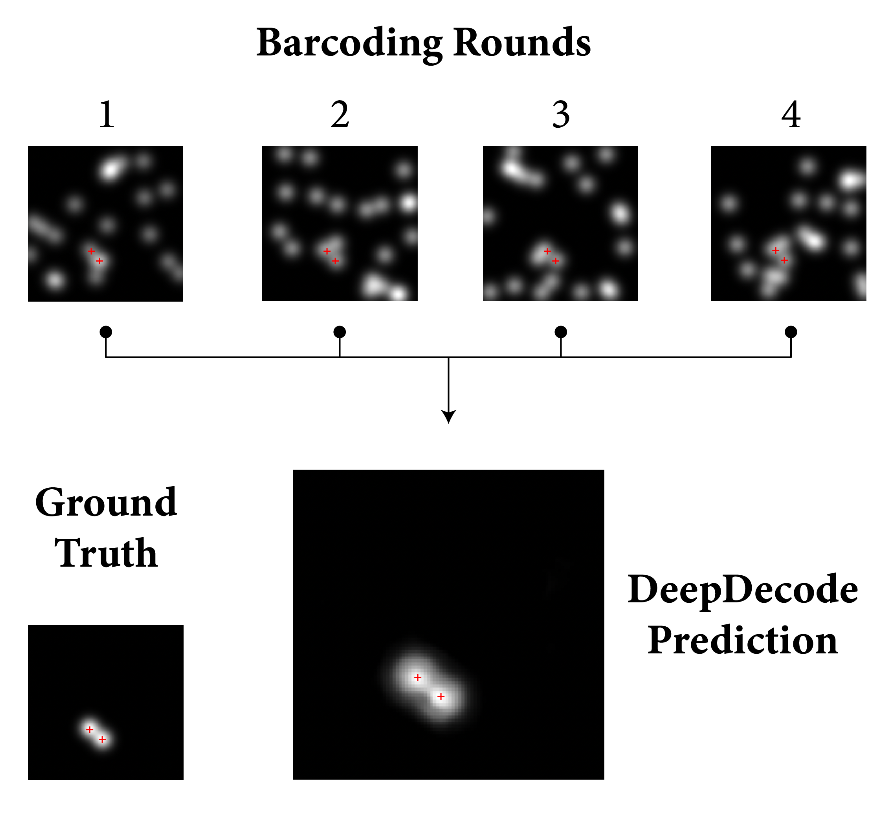

## Description

DeepDecode is a deep-learning algorithm written for the primary purpose of decoding sequentially encoded molecular fluorescence data (eg. SeqFISH, SeqFISH+ data). Given several 2D images that represent dispirate "barcoding rounds," this algorithm can essentially detect signal and determine parity all in one step. This takes much of the guesswork out of signal detection and decoding of SeqFISH datasets.

## DeepDecoded Dataset Result - Mouse Testes
### High-Resolution Tissue Segmentation
This is a completely decoded SeqFISH dataset - the mouse testes - generated using DeepDecode.

### Clustering and Gene Enrichment Analysis
The following are the results of UMAP generation and clustering applied to the aforementioned dataset, which produced the image you see above:

### Credit: Data was generated by the Cai Lab at Caltech.

## Neural Network Architecture

## Example Run on Gold-Standard Data

## Test Run DeepDecode

Simply fire up the attached jupyter notebook and watch it go!

## Author

[@Harshaan Sekhon](https://www.linkedin.com/in/shaan-sekhon-1a217b154/)

## Version History

* 1.0.0: Initial Release

## License

Copyright (C) California Institute of Technology - All Rights Reserved

See LISCENCE.md for more details.
