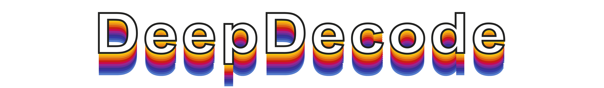
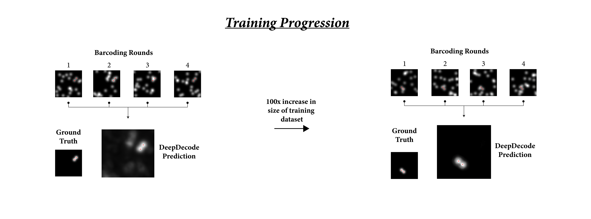

## Description

DeepDecode is a deep-learning algorithm written for the primary purpose of decoding sequentially encoded molecular fluorescence data (eg. SeqFISH, SeqFISH+ data). Given several 2D images that represent dispirate "barcoding rounds," this algorithm can 

### Neural Network Architecture

### Example Run on Gold-Standard Data

### Completely Decoded Dataset Result
This is a completely decoded SeqFISH dataset of the mouse testes, generated using DeepDecode.

## Test Run DeepDecode

Simply fire up the attached jupyter notebook and watch it go!

## Author

[@Harshaan Sekhon](https://www.linkedin.com/in/shaan-sekhon-1a217b154/)

## Version History

* 1.0.0: Initial Release

## License

Copyright (C) California Institute of Technology - All Rights Reserved

See LISCENCE.md for more details.
